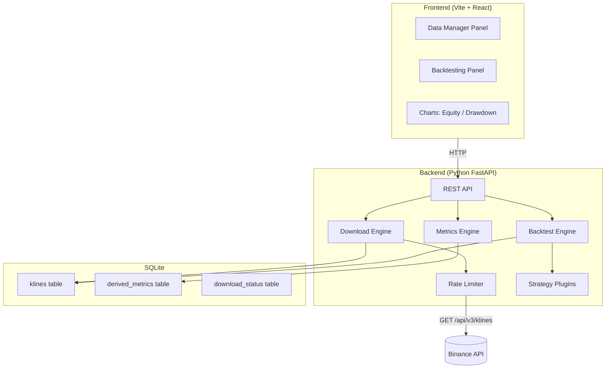

# Trading Tools Laboratory — Implementation Plan

Local-first laboratory for downloading Binance Spot historical data, maintaining OHLCV datasets with integrity, and running configurable strategy backtests with a premium dashboard.

## Architecture Overview



**Stack choices:**
- **Backend**: Python 3.11+ with FastAPI + uvicorn. Python gives us pandas/numpy for calculations and excellent Binance lib support.
- **Database**: SQLite (zero-cost, local-first, single-file). Using `aiosqlite` for async.
- **Frontend**: React 18 + Vite + Recharts (charts) + vanilla CSS with modern design tokens.
- **No API key required**: Binance klines endpoint is public (no auth needed).

---

## Proposed Changes

### Component 1: Project Structure & Foundation

#### [NEW] [requirements.txt](file:///home/juanjocop/proyectos/tradingtools/requirements.txt)
Python deps: `fastapi`, `uvicorn[standard]`, `aiosqlite`, `httpx`, `pandas`, `numpy`, `pydantic`.

#### [NEW] [run.py](file:///home/juanjocop/proyectos/tradingtools/run.py)
Entry point: starts uvicorn serving FastAPI app + static frontend files.

#### [NEW] [backend/\_\_init\_\_.py](file:///home/juanjocop/proyectos/tradingtools/backend/__init__.py)

#### [NEW] [backend/app.py](file:///home/juanjocop/proyectos/tradingtools/backend/app.py)
FastAPI app factory. Mounts API routes and serves frontend static files from `frontend/dist/`.

#### [NEW] [backend/database.py](file:///home/juanjocop/proyectos/tradingtools/backend/database.py)
SQLite setup with `aiosqlite`. Schema creation on startup. Tables:

**`klines`** — one row per candle:
| Column | Type | Notes |
|--------|------|-------|
| symbol | TEXT | e.g. BTCUSDT |
| interval | TEXT | 1h, 1d, 1w, 1M |
| open_time | INTEGER | ms timestamp, PK part |
| open | TEXT | string to preserve precision |
| high | TEXT | |
| low | TEXT | |
| close | TEXT | |
| volume | TEXT | |
| close_time | INTEGER | ms timestamp |
| quote_asset_volume | TEXT | |
| number_of_trades | INTEGER | |
| taker_buy_base_vol | TEXT | |
| taker_buy_quote_vol | TEXT | |
| ignore_field | TEXT | |
| source | TEXT | default "binance_spot" |
| downloaded_at | TEXT | ISO timestamp |

PK: `(symbol, interval, open_time)` → guarantees no duplicates.

**`download_jobs`** — tracks download state:
| Column | Type |
|--------|------|
| id | INTEGER PK |
| symbol | TEXT |
| interval | TEXT |
| start_time | INTEGER |
| end_time | INTEGER |
| status | TEXT |
| progress_pct | REAL |
| candles_downloaded | INTEGER |
| candles_expected | INTEGER |
| gaps_found | INTEGER |
| created_at | TEXT |
| updated_at | TEXT |
| log | TEXT (JSON array) |

**`derived_metrics`** — cached computed metrics:
| Column | Type |
|--------|------|
| symbol | TEXT |
| interval | TEXT |
| open_time | INTEGER |
| metric_name | TEXT |
| value | REAL |

PK: `(symbol, interval, open_time, metric_name)`.

---

### Component 2: Binance API Client & Rate Limiter

#### [NEW] [backend/binance\_client.py](file:///home/juanjocop/proyectos/tradingtools/backend/binance_client.py)
- Uses `httpx.AsyncClient` to call `GET https://api.binance.com/api/v3/klines`.
- Parameters: `symbol`, `interval`, `startTime`, `endTime`, `limit=500`.
- Parses response headers: `X-MBX-USED-WEIGHT-1m` for weight tracking.
- Exposes current weight/limit state to API consumers.
- On HTTP 429: exponential backoff with jitter, logs event.
- On HTTP 418: reads `Retry-After`, blocks all requests until that time.
- Pacing: minimum 100ms between requests (configurable), max ~10 req/s.
- Returns parsed list of candle dicts.

#### [NEW] [backend/download\_engine.py](file:///home/juanjocop/proyectos/tradingtools/backend/download_engine.py)
- Core download orchestrator. Input: symbol, interval, start_time, end_time.
- Steps:
  1. Query existing candles in DB for this (symbol, interval, [start, end]).
  2. Compute expected candle timestamps (aligned to interval boundaries in UTC).
  3. Find gaps (missing timestamps).
  4. Batch gaps into request ranges (max 500 candles per request).
  5. Download each batch via `binance_client`, upsert into DB.
  6. Update `download_jobs` row with progress.
  7. After all batches: re-scan for remaining gaps, report.
- Validates each candle: `low <= min(open, close)` and `high >= max(open, close)`.
- Runs as async background task; job status queryable via API.

---

### Component 3: Derived Metrics Engine

#### [NEW] [backend/metrics\_engine.py](file:///home/juanjocop/proyectos/tradingtools/backend/metrics_engine.py)
- Loads OHLCV data into pandas DataFrame.
- Computes selectable metrics:
  - `returns_simple`, `returns_log`
  - `sma_N`, `ema_N` (N configurable: 20, 50, 200)
  - `volatility_N` (rolling std of returns)
  - `atr_N` (Average True Range)
  - `range` (high - low), `true_range`
  - `rolling_max_N`, `rolling_min_N`
  - `donchian_upper_N`, `donchian_lower_N`
- Saves results to `derived_metrics` table (upsert).

---

### Component 4: Backtesting Engine

#### [NEW] [backend/backtest\_engine.py](file:///home/juanjocop/proyectos/tradingtools/backend/backtest_engine.py)
- Loads candles from DB for given (symbol, interval, range).
- Iterates candles chronologically. For each candle:
  1. **Check stop loss** (intrabar): if position open, check Low/High vs stop price. Gap handling: if Open already past stop, assume execution at Open.
  2. **Check exit signal** (close-based): if Close crosses exit threshold, schedule exit.
  3. **Check entry signal** (close-based): if flat and Close crosses entry threshold, schedule entry.
- Execution modes: `open_next` (default, execute at Open(t+1)) or `close_current`.
- Tracks equity curve, drawdown, generates trade log.
- Checks bankruptcy: if equity ≤ 0, terminates with liquidation event.
- Applies transaction costs (bps) on each trade.
- Returns: `BacktestResult` with equity_curve, drawdown_curve, trade_log, summary_metrics.

#### [NEW] [backend/strategies/\_\_init\_\_.py](file:///home/juanjocop/proyectos/tradingtools/backend/strategies/__init__.py)
Strategy registry: discovers and registers available strategies.

#### [NEW] [backend/strategies/base.py](file:///home/juanjocop/proyectos/tradingtools/backend/strategies/base.py)
Abstract base class `Strategy`:
```python
class Strategy(ABC):
    name: str
    description: str
    
    @abstractmethod
    def get_parameters(self) -> list[ParameterDef]:
        """Return list of parameter definitions (name, type, default, min, max, description)."""
    
    @abstractmethod
    def init(self, params: dict, candles: pd.DataFrame):
        """Pre-compute indicators/signals on candle data."""
    
    @abstractmethod  
    def on_candle(self, t: int, candle: Series, state: PositionState) -> list[Signal]:
        """Return entry/exit/stop signals for candle at index t."""
```

#### [NEW] [backend/strategies/breakout.py](file:///home/juanjocop/proyectos/tradingtools/backend/strategies/breakout.py)
Implements the "Breakout por cierre con stop porcentual y salida por ruptura" strategy with exact rules from the spec:
- `MaxPrev(t)` = max(High) of N_entrada candles before t (exclusive).
- `MinPrev(t)` = min(Low) of N_entrada candles before t (exclusive).
- Entry Long: `Close(t) > MaxPrev(t)` while flat.
- Stop Long: `MinPrev(t_entry) * (1 - stop_pct)`, triggered if `Low(t) <= StopLong`.
- Exit Long: `Close(t) < MinExit(t)` where MinExit uses M_salida window.
- Short: mirror logic.
- Parameters: N_entrada, M_salida, stop_pct, modo_ejecucion, habilitar_long, habilitar_short, coste_total_bps.

#### [NEW] [backend/backtest\_metrics.py](file:///home/juanjocop/proyectos/tradingtools/backend/backtest_metrics.py)
Computes result metrics from trade log + equity curve:
- Net profit, CAGR, Max drawdown, Win rate, Profit factor
- Expectancy per trade, Avg win, Avg loss, Payoff ratio
- Number of trades, Sharpe ratio, Sortino ratio
- Time in market (exposure %)

---

### Component 5: REST API

#### [NEW] [backend/api/data\_routes.py](file:///home/juanjocop/proyectos/tradingtools/backend/api/data_routes.py)
- `GET /api/pairs` — list available pairs
- `POST /api/download` — start download job (symbol, interval, start, end)
- `GET /api/download/{job_id}` — poll job status + progress + log
- `GET /api/download/{job_id}/cancel` — cancel job
- `GET /api/candles` — query stored candles (symbol, interval, start, end)
- `GET /api/rate-limit` — current Binance API weight status
- `POST /api/metrics/compute` — trigger derived metrics calculation
- `GET /api/metrics/status` — metrics computation status

#### [NEW] [backend/api/backtest\_routes.py](file:///home/juanjocop/proyectos/tradingtools/backend/api/backtest_routes.py)
- `GET /api/strategies` — list available strategies with parameter definitions
- `POST /api/backtest` — run backtest (symbol, interval, range, strategy, params, capital config)
- `GET /api/backtest/{id}` — get results
- `GET /api/backtest/{id}/export` — export CSV/JSON

---

### Component 6: Frontend Dashboard

#### [NEW] [frontend/](file:///home/juanjocop/proyectos/tradingtools/frontend/)
Vite + React project initialized with `npx create-vite`.

#### [NEW] [frontend/src/App.jsx](file:///home/juanjocop/proyectos/tradingtools/frontend/src/App.jsx)
Main app with tab navigation: **Data Manager** | **Backtesting**.

#### [NEW] [frontend/src/index.css](file:///home/juanjocop/proyectos/tradingtools/frontend/src/index.css)
Premium dark-mode design system with CSS custom properties: colors, spacing, typography (Inter font), glassmorphism cards, smooth transitions.

#### [NEW] [frontend/src/components/DataManager.jsx](file:///home/juanjocop/proyectos/tradingtools/frontend/src/components/DataManager.jsx)
- Multi-select pair picker (BTCUSDT default, extensible).
- Timeframe selector (1h, 1d, 1w, 1M).
- Date range pickers (start/end).
- "Download / Update" button → starts job, shows progress panel.
- Progress: % bar, candles downloaded/expected, gaps found, ETA.
- Event log (scrollable): download started, 429 received, backoff, completed, etc.
- Rate limit indicator: weight used, status badge (OK / Warning / Backoff / Blocked).
- "Calculate Derived Metrics" button (conditionally shown).

#### [NEW] [frontend/src/components/BacktestPanel.jsx](file:///home/juanjocop/proyectos/tradingtools/frontend/src/components/BacktestPanel.jsx)
- Pair + interval + date range selectors.
- Strategy dropdown (populated from API).
- Dynamic parameter form (rendered from strategy parameter definitions).
- Capital configuration: toggle between leverage mode and notional mode.
- "Run Backtest" button.
- Results section: metrics cards, equity chart, drawdown chart, trade log table.
- Export button (CSV/JSON).

#### [NEW] [frontend/src/components/EquityChart.jsx](file:///home/juanjocop/proyectos/tradingtools/frontend/src/components/EquityChart.jsx)
Recharts-based equity curve + drawdown chart with responsive design.

#### [NEW] [frontend/src/components/TradeLog.jsx](file:///home/juanjocop/proyectos/tradingtools/frontend/src/components/TradeLog.jsx)
Sortable/scrollable table showing all trades with entry/exit details, PnL, fees.

---

## Key Design Decisions

> [!IMPORTANT]
> **Prices stored as strings** to preserve Binance's exact decimal precision. Converted to `float` only during computation.

> [!IMPORTANT]
> **No API key required.** The `/api/v3/klines` endpoint is public. Rate limits are per-IP (1200 weight/minute typical).

> [!NOTE]
> **Candle alignment**: For 1h/1d intervals, open_time is aligned to UTC boundaries. For 1w, Binance uses Monday 00:00 UTC. For 1M, first day of month 00:00 UTC. Gap detection uses these alignment rules.

> [!NOTE]
> **Execution modes**: Default is conservative (Open(t+1)). The engine skips the first N_entrada candles to warm up indicators without lookahead bias.

---

## Verification Plan

### Automated Tests

1. **Backend unit tests** — run with `cd /home/juanjocop/proyectos/tradingtools && python -m pytest tests/ -v`:
   - `tests/test_download_engine.py`: mock Binance responses, verify gap detection, dedup, upsert logic.
   - `tests/test_backtest_engine.py`: feed known candle data, verify trade signals match expected entries/exits, verify stop loss triggers, verify bankruptcy detection.
   - `tests/test_breakout_strategy.py`: verify MaxPrev/MinPrev calculations, entry/exit signals on synthetic data.
   - `tests/test_metrics.py`: verify Sharpe, max drawdown, win rate calculations against hand-computed values.

2. **Frontend build check** — run with `cd /home/juanjocop/proyectos/tradingtools/frontend && npm run build`:
   - Verifies the frontend compiles without errors.

### Browser Verification

3. **End-to-end visual test** — using browser tool:
   - Start the app (`python run.py`), open `http://localhost:8000`.
   - Verify Data Manager panel renders with selectors and download button.
   - Trigger a small download (BTCUSDT, 1d, last 30 days) and verify progress updates.
   - Switch to Backtesting tab, verify strategy selector loads with "Breakout" strategy.
   - Run a backtest and verify equity chart, metrics cards, and trade log render.

### Manual Verification (User)

4. **User visual review**: After browser tests, the user can visually verify the dashboard design, try different parameters, and confirm the UX feels premium and responsive.
